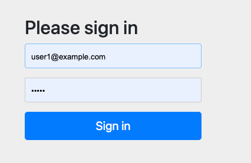
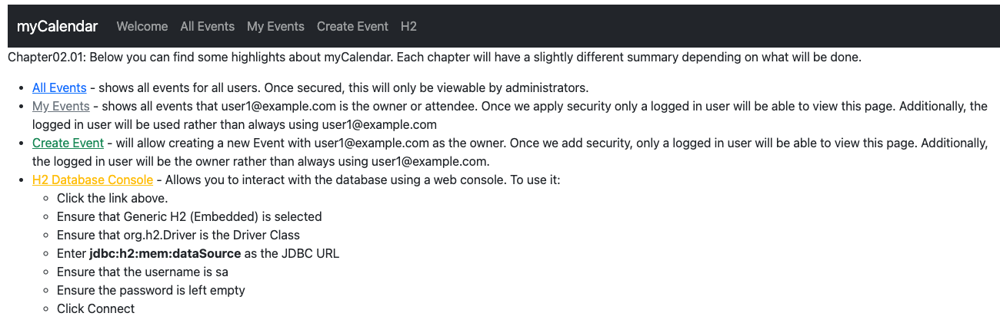

# chapter02.01-calendar #

Execute the below command using Gradle from the project directory:

```shell
./gradlew tomcatRun
```

Alternatively, if you're using Maven, execute the following command from the project directory:

```shell
./mvnw package cargo:run
```

To test the application, open a web browser and navigate to:
[http://localhost:8080](http://localhost:8080)




At this point, you should be able to log in using `user1@example.com` as User and `user1` as Password. 

You'll see the calendar welcome page, which describes at a high level what to expect from the application in terms of security.
