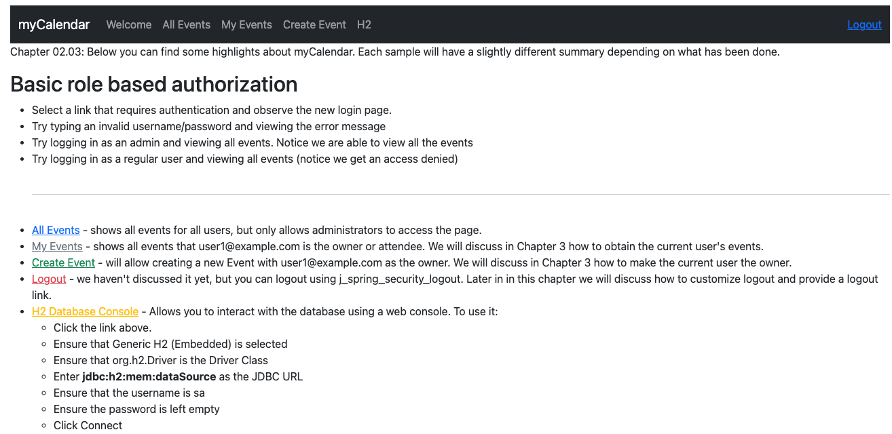
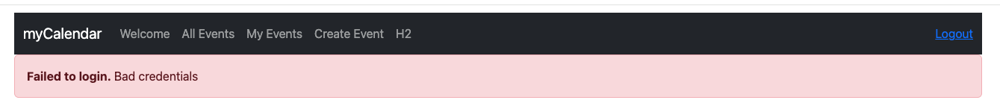
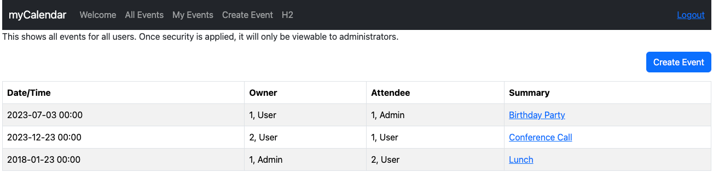
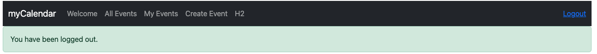
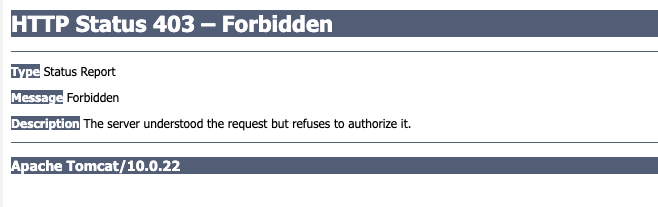

# chapter02.03-calendar #

Execute the below command using Gradle from the project directory:

```shell
./gradlew tomcatRun
```

Alternatively, if you're using Maven, execute the following command from the project directory:

```shell
./mvnw package cargo:run
```

To test the application, open a web browser and navigate to:
[http://localhost:8080](http://localhost:8080)


1. Try typing an invalid username/password and view the error message.

2. Try logging in as an admin (`admin1@example.com`/`admin1`), and view all of the events. Note that we are able to view all the events.

3. Try logging out and view the logout success message.

4. Try logging in as a regular user (`user1@example.com`/`user1`), and view all of the events. Note that we get an Access forbidden default tomcat page.

