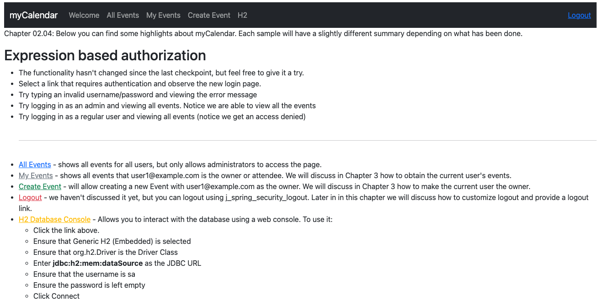
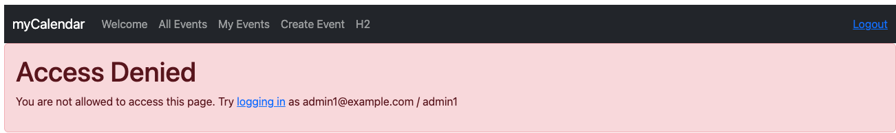

# chapter02.04-calendar #

Execute the below command using Gradle from the project directory:

```shell
./gradlew tomcatRun
```

Alternatively, if you're using Maven, execute the following command from the project directory:

```shell
./mvnw package cargo:run
```

To test the application, open a web browser and navigate to:
[http://localhost:8080](http://localhost:8080)


Try logging in as a regular user (`user1@example.com`/`user1`), and view all of the events. Note that we get the custom Access Denied page.
   
