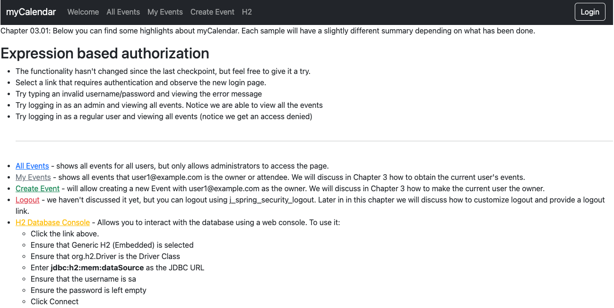
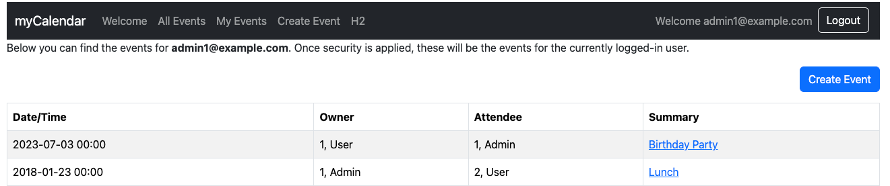
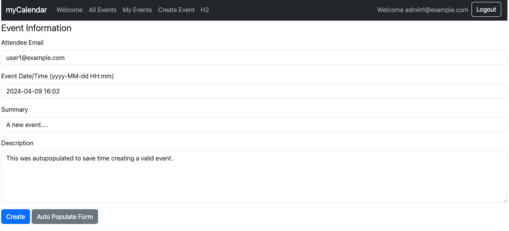
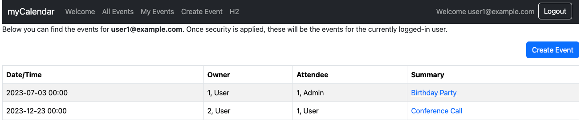

# chapter03.01-calendar #

Execute the below command using Gradle from the project directory:

```shell
./gradlew bootRun
```

Alternatively, if you're using Maven, execute the following command from the project directory:

```shell
./mvnw spring-boot:run
```

To test the application, open a web browser and navigate to:
[http://localhost:8080](http://localhost:8080)


1. Log in with `admin1@example.com` as the username and `admin1` as the password.
2. Visit the `My Events` page, and you will see that only the events for that current user, who is the owner or the attendee, are displayed.
   
3. Try creating a new event; you will observe that the owner of the event is now associated with the logged-in user.
   
4. Log out of the application and repeat these steps with user1@example.com as the username and user1 as the password.
   