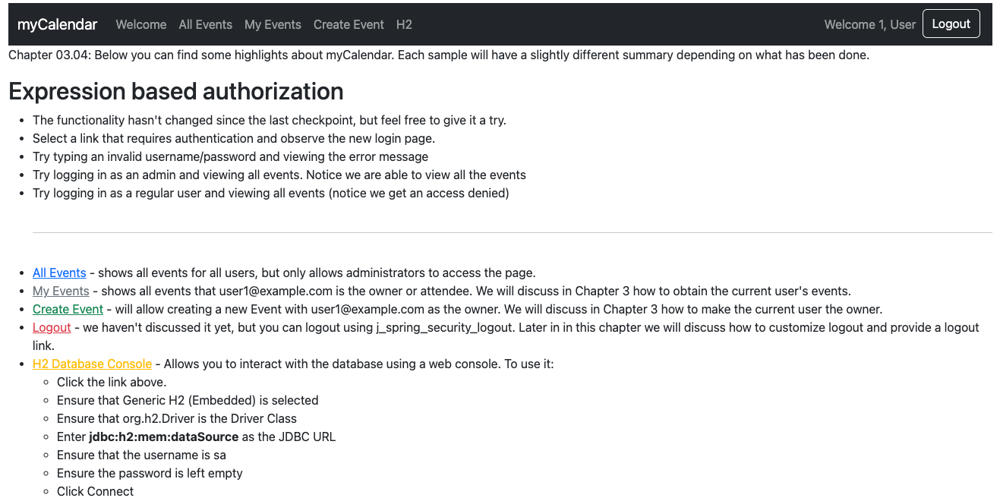

# chapter03.04-calendar #

Execute the below command using Gradle from the project directory:

```shell
./gradlew bootRun
```

Alternatively, if you're using Maven, execute the following command from the project directory:

```shell
./mvnw spring-boot:run
```

To test the application, open a web browser and navigate to:
[http://localhost:8080](http://localhost:8080)


Log in to view the updates. Instead of seeing the current user's email, you should now see their first and last names.
