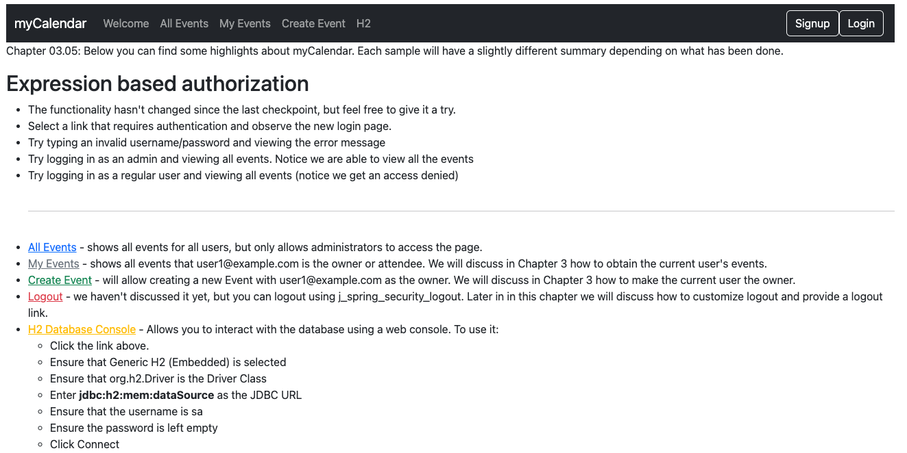

# chapter03.05-calendar #

Execute the below command using Gradle from the project directory:

```shell
./gradlew bootRun
```

Alternatively, if you're using Maven, execute the following command from the project directory:

```shell
./mvnw spring-boot:run
```

To test the application, open a web browser and navigate to:
[http://localhost:8080](http://localhost:8080)


As a user, we do not notice anything different. 
However, as a developer, we know that CalendarUserDetails is no longer required; we are still able to display the current user's first and last names, and Spring Security is still able to leverage CalendarUser for authentication.
