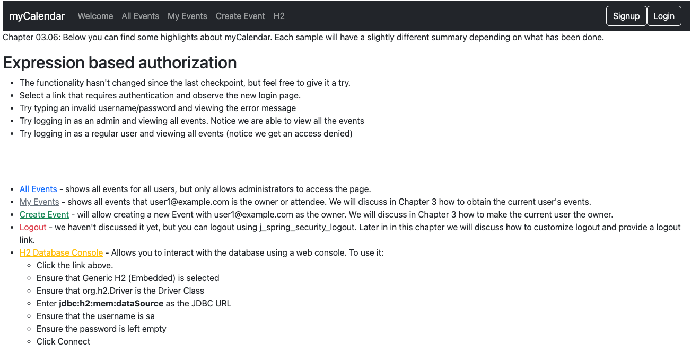
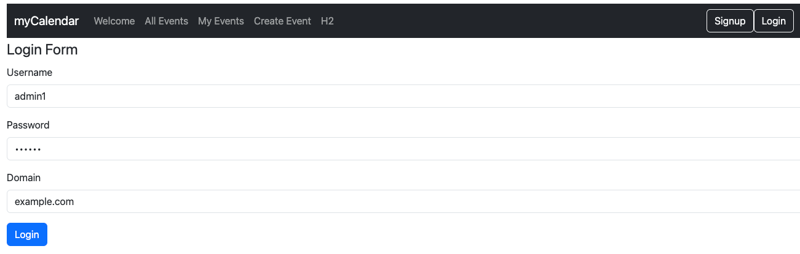

# chapter03.06-calendar #

Execute the below command using Gradle from the project directory:

```shell
./gradlew bootRun
```

Alternatively, if you're using Maven, execute the following command from the project directory:

```shell
./mvnw spring-boot:run
```

To test the application, open a web browser and navigate to:
[http://localhost:8080](http://localhost:8080)


1.	Visit http://localhost:8080/events
2.	Spring Security will intercept the secured URL and use the `LoginUrlAuthenticationEntryPoint` object to process it.
3.	The `LoginUrlAuthenticationEntryPoint` object will send the user to the login page. Enter `admin1` as the username, `example.com` as the domain, and `admin1` as the password.

4.	The `DomainUsernamePasswordAuthenticationFilter` object will intercept the process of the login request. It will then obtain the username, domain, and password from the HTTP request and create a `DomainUsernamePasswordAuthenticationToken` object.
5.	The `DomainUsernamePasswordAuthenticationFilter` object submits `DomainUsernamePasswordAuthenticationToken` to `CalendarUserAuthenticationProvider`.
6.	The `CalendarUserAuthenticationProvider` interface validates `DomainUsernamePasswordAuthenticationToken` and then returns an authenticated `DomainUsernamePasswordAuthenticationToken` object (that is, `isAuthenticated()` returns `true`).
7.	The `DomainUserPasswordAuthenticationFilter` object updates `SecurityContext` with `DomainUsernamePasswordAuthenticationToken` and places it on `SecurityContextHolder`.
