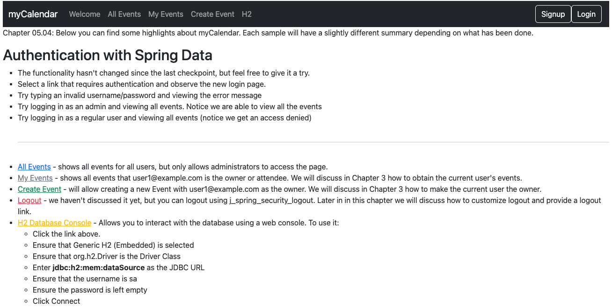

# chapter05.04-calendar #

Execute the below command using Gradle from the project directory:

```shell
./gradlew bootRun
```

Alternatively, if you're using Maven, execute the following command from the project directory:

```shell
./mvnw spring-boot:run
```

To test the application, open a web browser and navigate to:
[http://localhost:8080](http://localhost:8080)


Try logging in to the application.
Any of the configured users can now log in and create new events. 
You can also create a new user and will be able to log in as the new user immediately.

