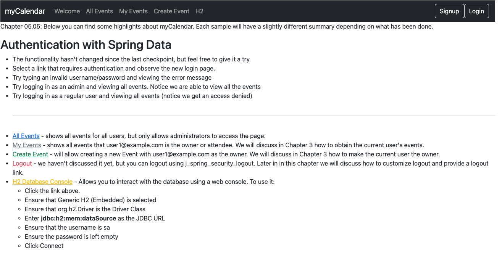

# chapter05.05-calendar #

Execute the below command using Gradle from the project directory:

```shell
./gradlew bootRun
```

Alternatively, if you're using Maven, execute the following command from the project directory:

```shell
./mvnw spring-boot:run
```

To test the application, open a web browser and navigate to:
[http://localhost:8080](http://localhost:8080)


Try to log in as `user1` and `admin1`, and test it to ensure that both users can add new events to the system, to ensure the mapping is correct for the entire application.

