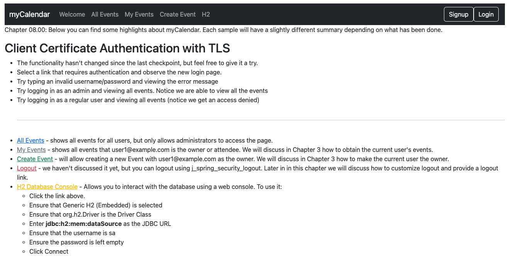
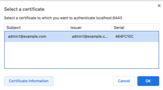

# chapter08.00-calendar #

Creating a client certificate key pair

```shell
keytool -genkeypair -alias jbcpclient -keyalg RSA -validity 365 -keystore jbcp_clientauth.p12 -storetype PKCS12
```

We'll export the public key to a standard certificate file named jbcp_clientauth.cer, as follows:
```shell
keytool -exportcert -alias jbcpclient -keystore jbcp_clientauth.p12 -storetype PKCS12 -storepass changeit -file jbcp_clientauth.cer
```
Next, we'll import the certificate into the trust store (this will create the trust store, but in a typical deployment scenario you'd probably already have some other certificates in the trust store):

```shell
keytool -importcert -alias jbcpclient -keystore tomcat.truststore -file jbcp_clientauth.cer
```

After importing the certificate to your browser, execute the below command using Gradle from the project directory:

```shell
./gradlew bootRun
```

Alternatively, if you're using Maven, execute the following command from the project directory:

```shell
./mvnw spring-boot:run
```

To test the application, open a web browser and navigate to:
[https://localhost:8443/](https://localhost:8443/)


You should be prompted for a certificate when you attempt to access the site—in Chrome, the certificate is displayed as follows:

