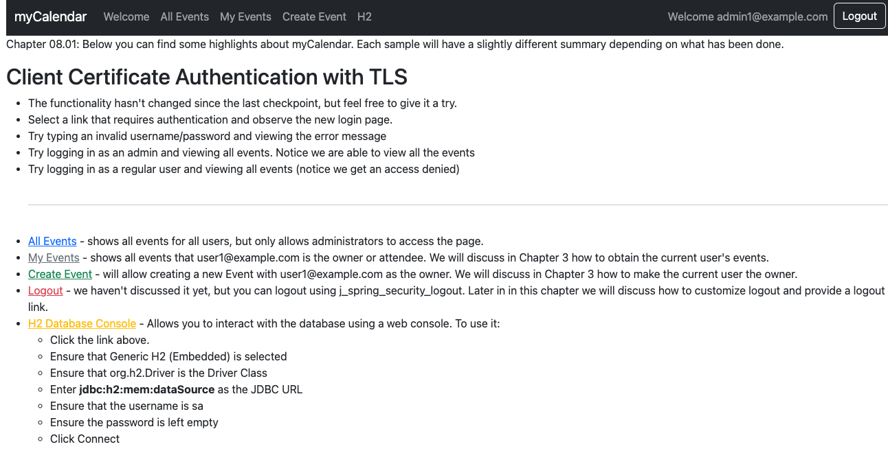

# chapter08.01-calendar #

Execute the below command using Gradle from the project directory:

```shell
./gradlew bootRun
```

Alternatively, if you're using Maven, execute the following command from the project directory:

```shell
./mvnw spring-boot:run
```

To test the application, open a web browser and navigate to:
[https://localhost:8443/](https://localhost:8443/)


You'll again be prompted for a client certificate, but this time, you should be able to access areas of the site requiring authorization. You can see from the logs (if you have them enabled) that you have been logged in as the `admin1@example.com` user.