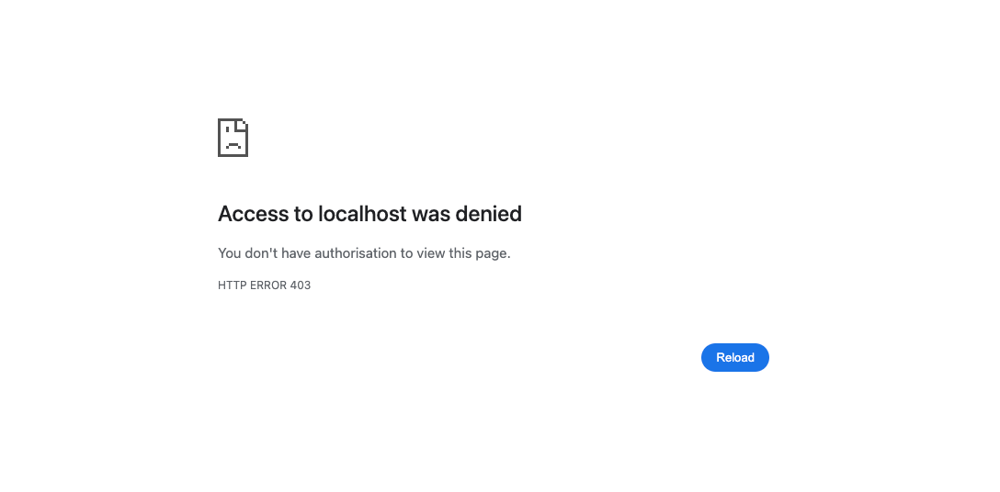

# chapter08.02-calendar #

Execute the below command using Gradle from the project directory:

```shell
./gradlew bootRun
```

Alternatively, if you're using Maven, execute the following command from the project directory:

```shell
./mvnw spring-boot:run
```

To test the application, open a web browser and navigate to:
[https://localhost:8443/](https://localhost:8443/)


If a user tries to access a protected resource and is unable to provide a valid certificate, they will be presented with the following page, instead of being redirected to the login page:
