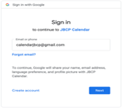
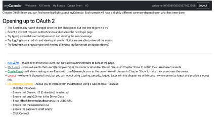

# chapter09.01-calendar #

Execute the below command using Gradle from the project directory:

```shell
./gradlew bootRun
```

Alternatively, if you're using Maven, execute the following command from the project directory:

```shell
./mvnw spring-boot:run
```


1.	Launch the sample application and go to https://localhost:8443/oauth2/authorization/google. 
You will be redirected to the default login page, which displays a link for Google.
2.	Click on the Google link, and you are then redirected to Google for authentication.
3.	The OAuth Client retrieves your email address and basic profile information from the UserInfo Endpoint ( find out more here: https://openid.net/specs/openid-connect-core-1_0.html#UserInfo )and establishes an authenticated session.
4.	At this point, you should be able to complete a full login using Google OAuth 2 provider. The redirects that occur are as follows, first, we initiate the OAuth 2 provider login as shown in the following screenshot:

5. After filling the logging details, the user is redirected to the JBCP Calendar application and automatically logged in using the provider display name:
   