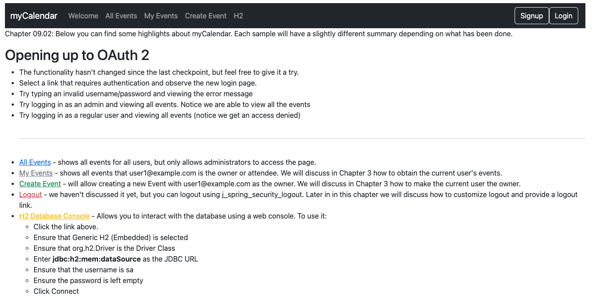

# chapter09.02-calendar #

Execute the below command using Gradle from the project directory:

```shell
./gradlew bootRun
```

Alternatively, if you're using Maven, execute the following command from the project directory:

```shell
./mvnw spring-boot:run
```

To test the application, open a web browser and navigate to:
[https://localhost:8443/](https://localhost:8443/)


Go to the Login page:


We are then redirected to the provider authorization page, requesting the user to grant permission to the `jbcpcalendar` application.
