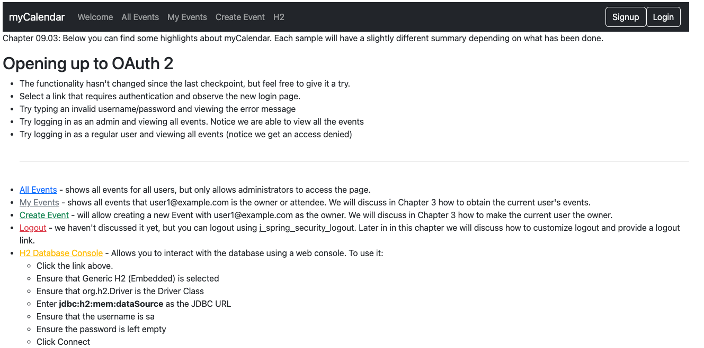
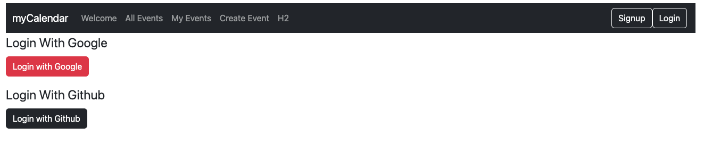
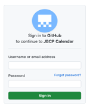
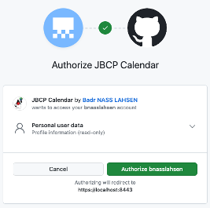

# chapter09.03-calendar #

Execute the below command using Gradle from the project directory:

```shell
./gradlew bootRun
```

Alternatively, if you're using Maven, execute the following command from the project directory:

```shell
./mvnw spring-boot:run
```

To test the application, open a web browser and navigate to:
[https://localhost:8443/](https://localhost:8443/)



Go to the Login page:


At this point, you should be able to complete a full login using Google OAuth 2 provider. The redirects that occur are as follows, first, we initiate the OAuth 2 provider login as shown in the following screenshot:


We are then redirected to the provider authorization page, requesting the user to grant permission to the `jbcpcalendar` application as shown in the following screenshot:



After authorizing the `jbcpcalendar` application, the user is redirected to the `jbcpcalendar` application and automatically logged in using the provider display name.