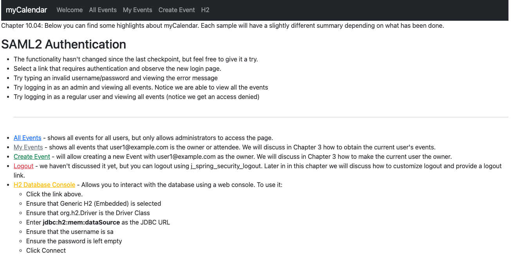
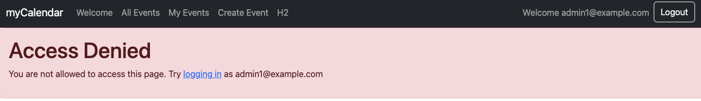

# chapter10.04-calendar #

Execute the below command using Gradle from the project directory:

```shell
./gradlew bootRun
```

Alternatively, if you're using Maven, execute the following command from the project directory:

```shell
./mvnw spring-boot:run
```

To test the application, open a web browser and navigate to:
[https://localhost:8443/](https://localhost:8443/)


You will notice that every authenticated user, has by default a role `ROLE_USER`.
For this step, the access to the page /events, should be forbidden




