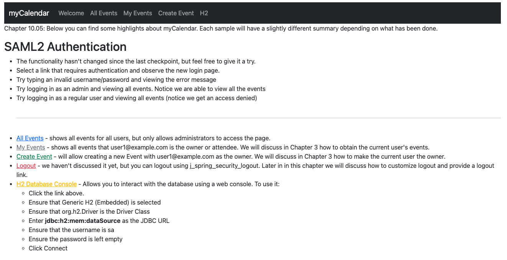
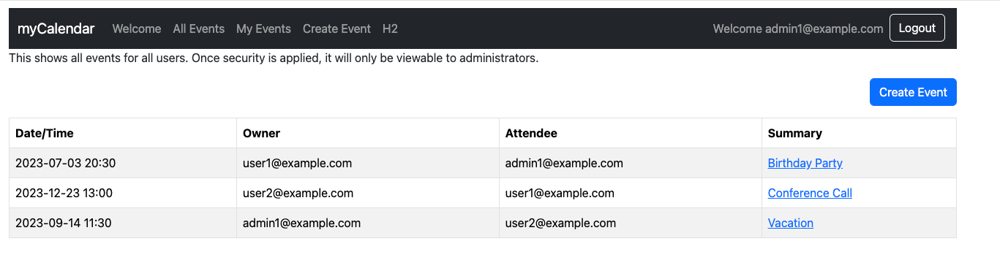

# chapter10.05-calendar #

Execute the below command using Gradle from the project directory:

```shell
./gradlew bootRun
```

Alternatively, if you're using Maven, execute the following command from the project directory:

```shell
./mvnw spring-boot:run
```

To test the application, open a web browser and navigate to:
[https://localhost:8443/](https://localhost:8443/)


Now, you should see your user’s groups as authorities. That comes from the OKTA SAML context related to the authenticated user.
You will notice that with these changes, you will have access to the `All Events` page when you log in with the user `admin1@example.com`.


