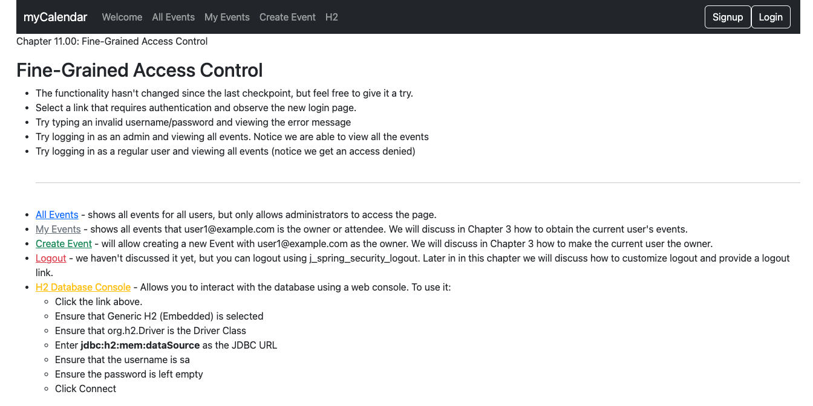

# chapter11.00-calendar #

Execute the below command using Gradle from the project directory:

```shell
./gradlew bootRun
```

Alternatively, if you're using Maven, execute the following command from the project directory:

```shell
./mvnw spring-boot:run
```

To test the application, open a web browser and navigate to:
[https://localhost:8443/](https://localhost:8443/)


Log in with the user `user1@example.com` and the password `user1`. 
You will observe that the My Events navigation menu item is displayed, and the All Events navigation menu item is displayed as well. 
