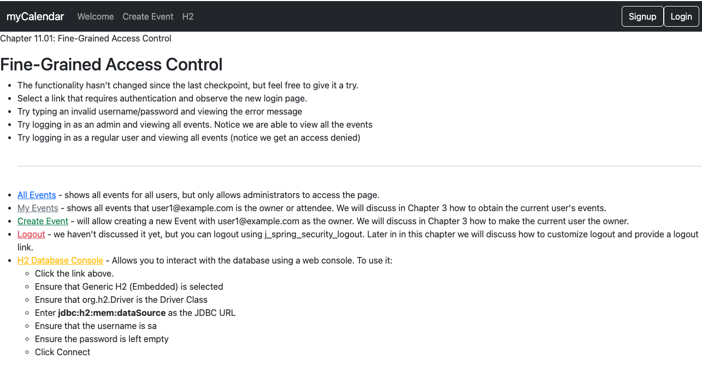
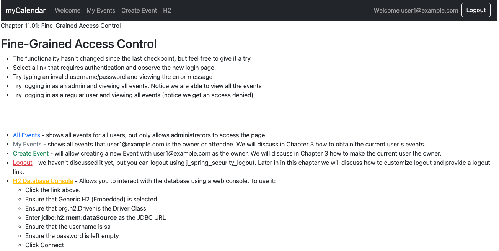
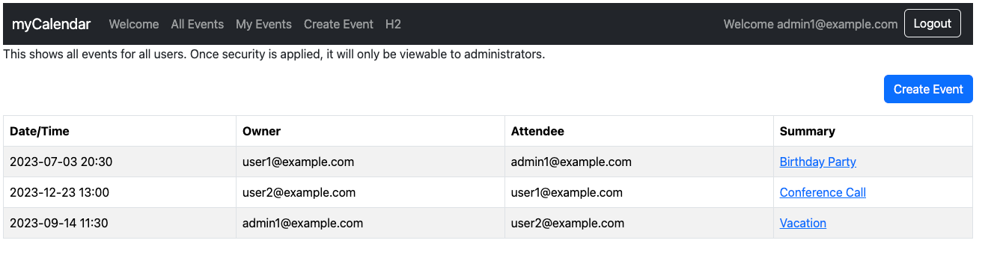

# chapter11.01-calendar #

Execute the below command using Gradle from the project directory:

```shell
./gradlew bootRun
```

Alternatively, if you're using Maven, execute the following command from the project directory:

```shell
./mvnw spring-boot:run
```

To test the application, open a web browser and navigate to:
[https://localhost:8443/](https://localhost:8443/)


Log in with the user `user1@example.com` and the password `user1`. You will observe that the My Events link is displayed, but the All Events navigation menu item is hidden (although it will still be present on the page).


Log out and log in as the user `admin1@example.com` with the password `admin1`. Now both links are visible.

