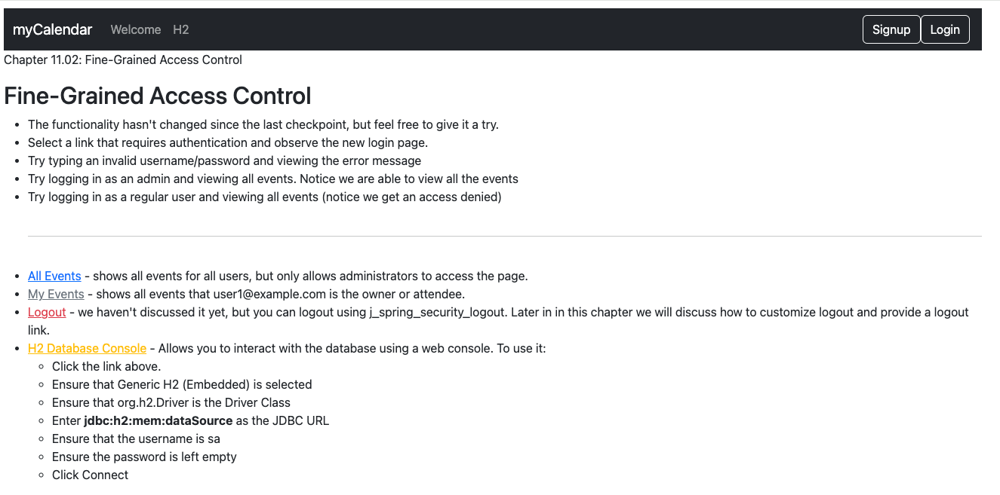
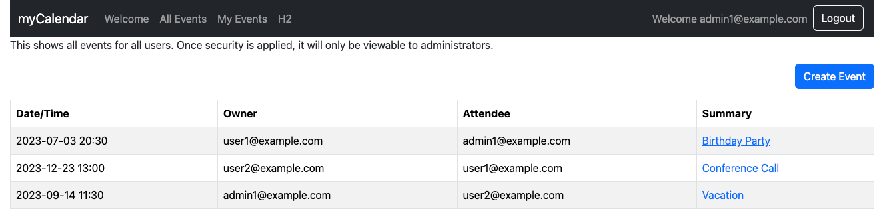

# chapter11.02-calendar #

Execute the below command using Gradle from the project directory:

```shell
./gradlew bootRun
```

Alternatively, if you're using Maven, execute the following command from the project directory:

```shell
./mvnw spring-boot:run
```

To test the application, open a web browser and navigate to:
[https://localhost:8443/](https://localhost:8443/)


Log in using `admin1@example.com` as the username and `admin1` as the password, and visit the `All Events` page. 
You should no longer see the Create Events navigation menu item (although it will still be present on the page).
