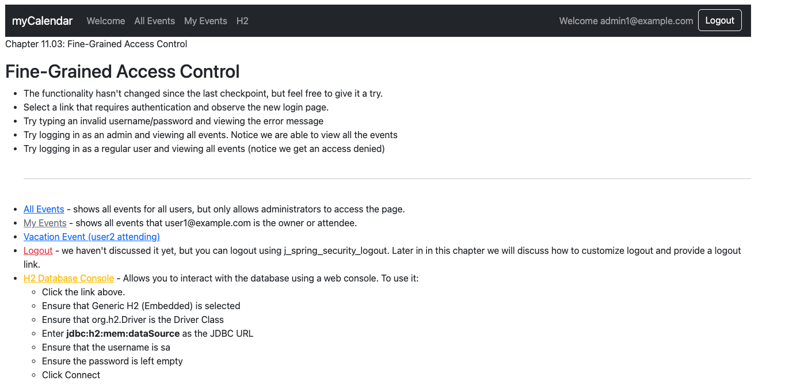

# chapter11.03-calendar #

Execute the below command using Gradle from the project directory:

```shell
./gradlew bootRun
```

Alternatively, if you're using Maven, execute the following command from the project directory:

```shell
./mvnw spring-boot:run
```

To test the application, open a web browser and navigate to:
[https://localhost:8443/](https://localhost:8443/)


View the Welcome page before you have logged in. 
The H2 link should not be visible. 
Log in as `admin1@example.com/admin1`, and you should see it.

