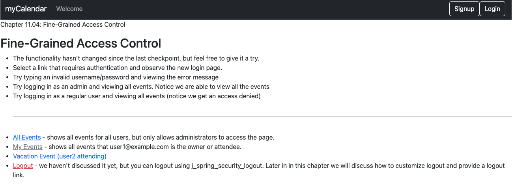
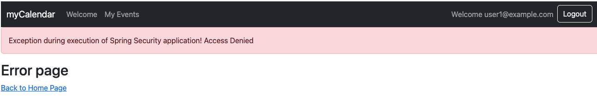

# chapter11.04-calendar #

Execute the below command using Gradle from the project directory:

```shell
./gradlew bootRun
```

Alternatively, if you're using Maven, execute the following command from the project directory:

```shell
./mvnw spring-boot:run
```

To test the application, open a web browser and navigate to:
[https://localhost:8443/](https://localhost:8443/)


Log in with `user1@example.com` as the username and `user1` as the password, and try accessing https://localhost:8443/events/backdoor.
You should see the Access Denied page now.



