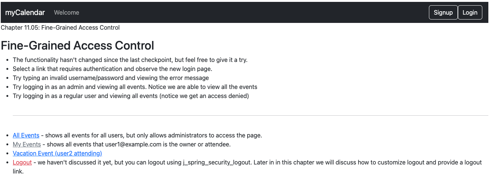
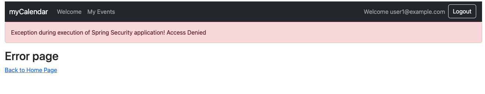

# chapter11.05-calendar #

Execute the below command using Gradle from the project directory:

```shell
./gradlew bootRun
```

Alternatively, if you're using Maven, execute the following command from the project directory:

```shell
./mvnw spring-boot:run
```

To test the application, open a web browser and navigate to:
[https://localhost:8443/](https://localhost:8443/)


Log in as `user1@example.com` and the password `user1`, and try to access https://localhost:8443/events/backdoor. You should see the Access Denied page again


