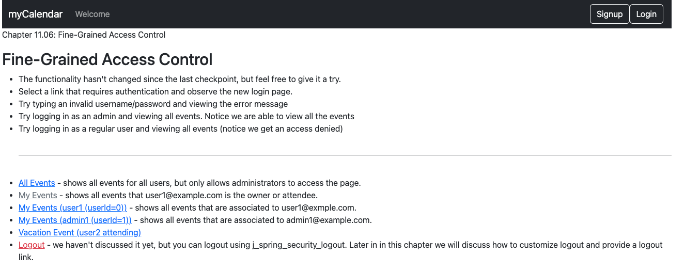
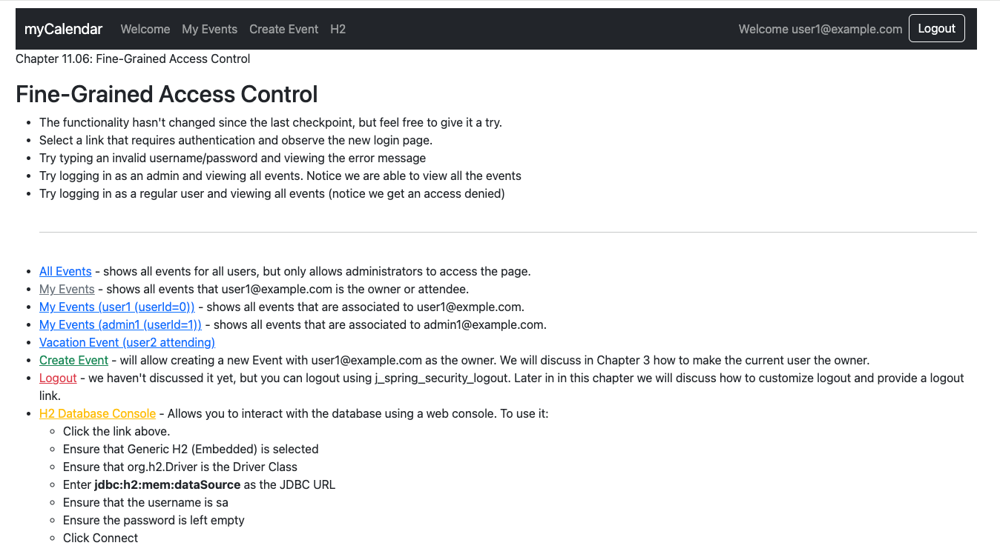
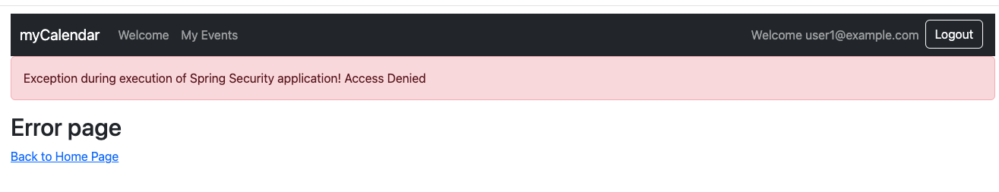
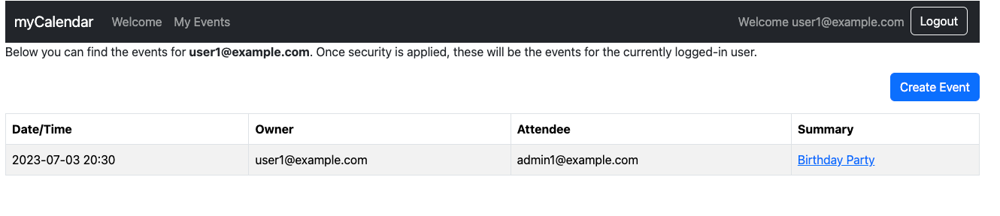

# chapter11.06-calendar #

Execute the below command using Gradle from the project directory:

```shell
./gradlew bootRun
```

Alternatively, if you're using Maven, execute the following command from the project directory:

```shell
./mvnw spring-boot:run
```

To test the application, open a web browser and navigate to:
[https://localhost:8443/](https://localhost:8443/)



Try logging in with `user1@example.com` as the username and `user1` as the password.


On the Welcome page, request the My Events. (email=admin1@example.com) link to see an Access Denied page.


Try again with My Events (email=user1@example.com) to see it work.

