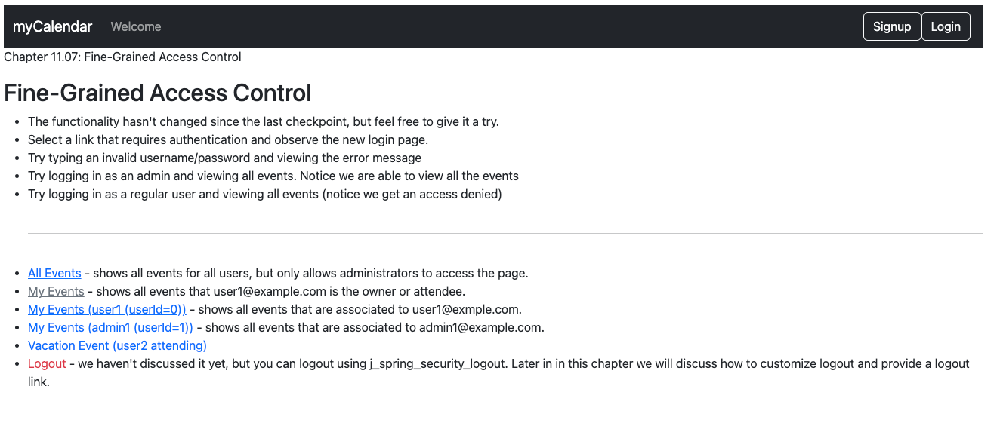
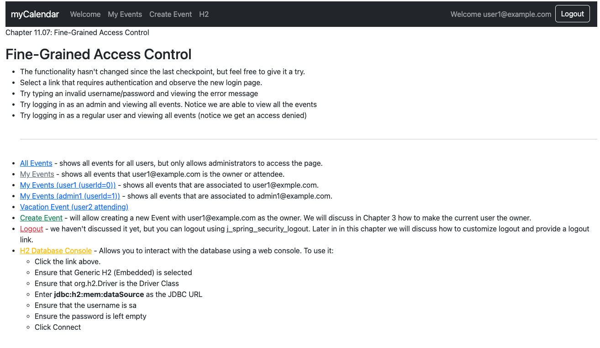
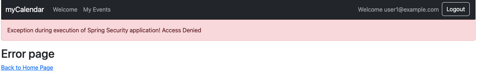
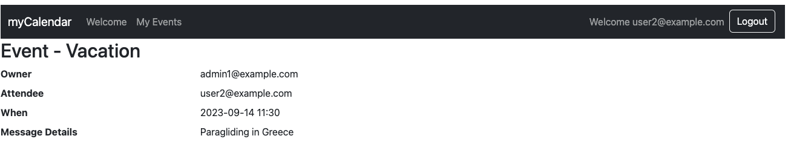

# chapter11.07-calendar #

Execute the below command using Gradle from the project directory:

```shell
./gradlew bootRun
```

Alternatively, if you're using Maven, execute the following command from the project directory:

```shell
./mvnw spring-boot:run
```

To test the application, open a web browser and navigate to:
[https://localhost:8443/](https://localhost:8443/)


Try logging in with the username `user1@example.com` and the password `user1`. 
Next, try accessing the Vacation Event using the link on the Welcome page.

You should now see the Access Denied page.


If you log in using the username `user2@example.com` and the password `user2`, the Vacation Event will display as expected since `user2@example.com` is the attendee at the Vacation Event.

