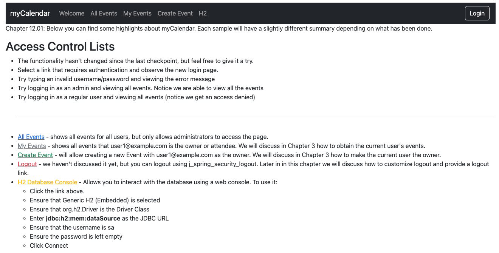

# chapter12.01-calendar #

Execute the below command using Gradle from the project directory:

```shell
./gradlew bootRun
```

Alternatively, if you're using Maven, execute the following command from the project directory:

```shell
./mvnw spring-boot:run
```

To test the application, open a web browser and navigate to:
[http://localhost:8080](http://localhost:8080)


It is worth noting that we have not created new ACL entries when we create events.
Thus, in the current state, if you create an event, you will receive an error similar to the following:
`Exception during execution of Spring Security application! Unable to find ACL information for object identity 'org.springframework.security.acls.domain.ObjectIdentityImpl[Type: com.packtpub.springsecurity.domain.Event; Identifier: 1]'
`

