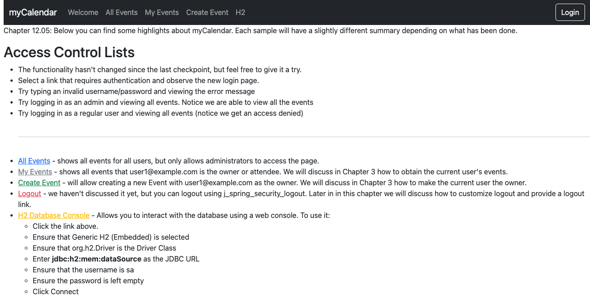

# chapter12.05-calendar #

Execute the below command using Gradle from the project directory:

```shell
./gradlew bootRun
```

Alternatively, if you're using Maven, execute the following command from the project directory:

```shell
./mvnw spring-boot:run
```

To test the application, open a web browser and navigate to:
[http://localhost:8080](http://localhost:8080)


Visit the `All Events` page and see that there are no events currently listed.

Then, create a new event and it will be displayed the next time you visit the `All Events` page. 

If you log in as any other user, the event will not be visible on the All Events page. 