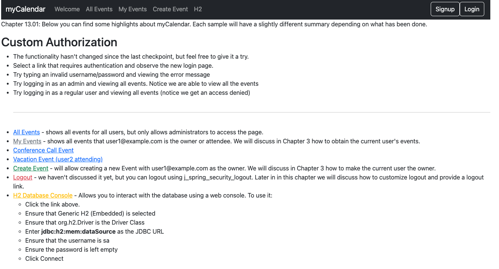

# chapter13.01-calendar #

Execute the below command using Gradle from the project directory:

```shell
./gradlew bootRun
```

Alternatively, if you're using Maven, execute the following command from the project directory:

```shell
./mvnw spring-boot:run
```

To test the application, open a web browser and navigate to:
[http://localhost:8080](http://localhost:8080)


You should now be able to start the application and test to ensure that our URLs are secured as they should be. 

Our users will not notice a difference, but we know that our URL mappings are persisted in a database now.