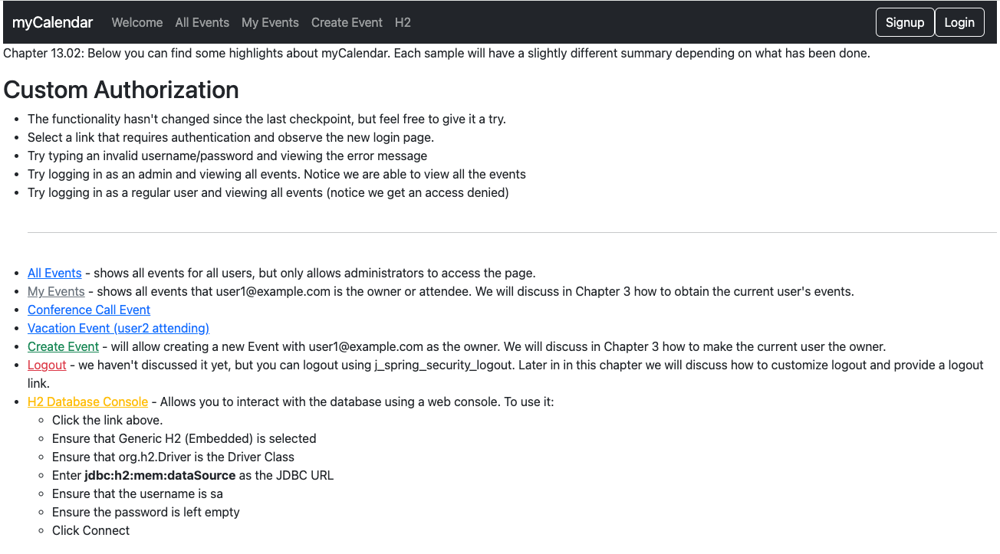
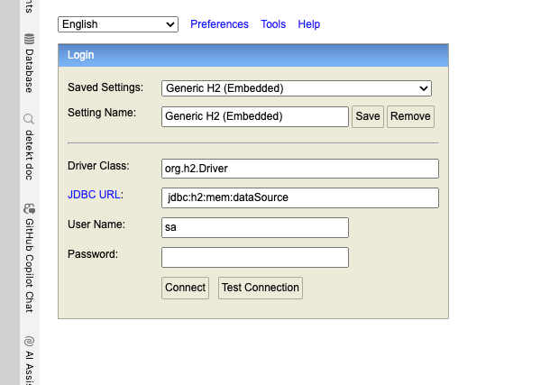
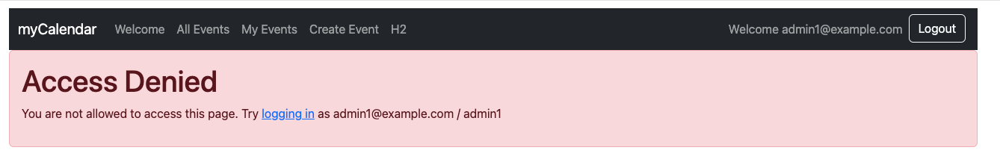

# chapter13.02-calendar #

Execute the below command using Gradle from the project directory:

```shell
./gradlew bootRun
```

Alternatively, if you're using Maven, execute the following command from the project directory:

```shell
./mvnw spring-boot:run
```

To test the application, open a web browser and navigate to:
[http://localhost:8080](http://localhost:8080)



Access the H2 console using http://localhost:8080/admin/h2 and `admin1@example.com`/`admin1` to see the admin console.


If the H2 console is accessed using http://127.0.0.1:8080/admin/h2 and `admin1@example.com`/`admin1`, the access denied page will be displayed.

