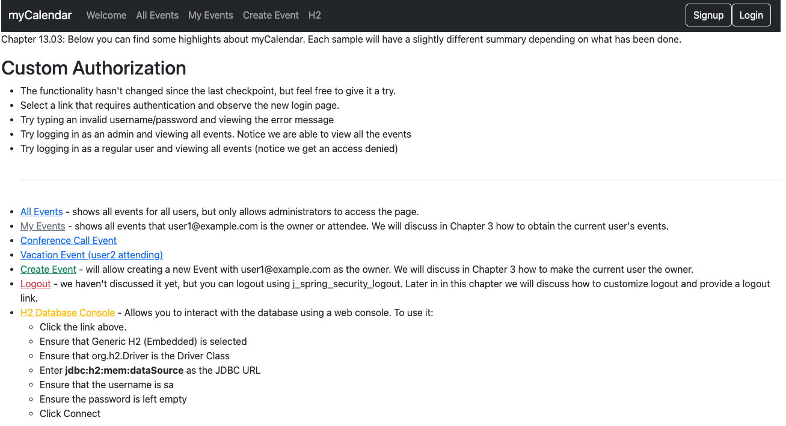
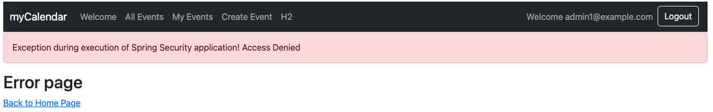

# chapter13.03-calendar #

Execute the below command using Gradle from the project directory:

```shell
./gradlew bootRun
```

Alternatively, if you're using Maven, execute the following command from the project directory:

```shell
./mvnw spring-boot:run
```

To test the application, open a web browser and navigate to:
[http://localhost:8080](http://localhost:8080)


Login in as username/password `admin1@example.com`/`admin1` and visit the `Conference Call event` (events/101) using the link on the Welcome page. 

The access denied page will be displayed.

