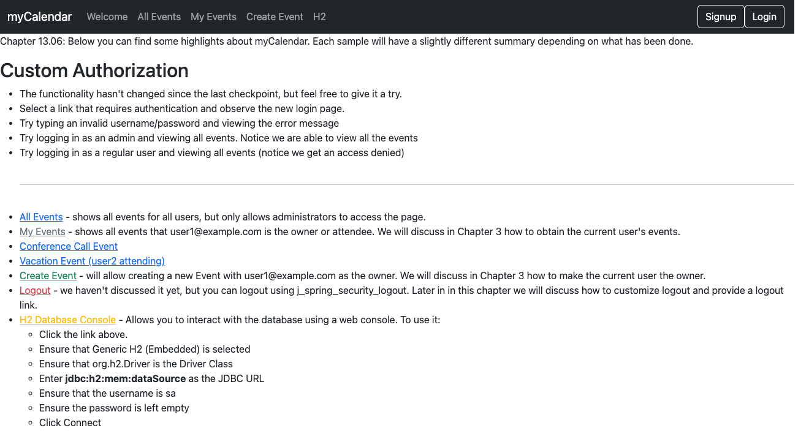
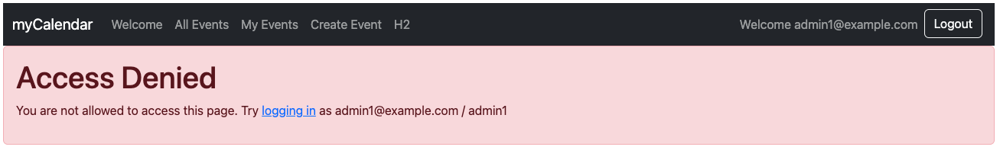
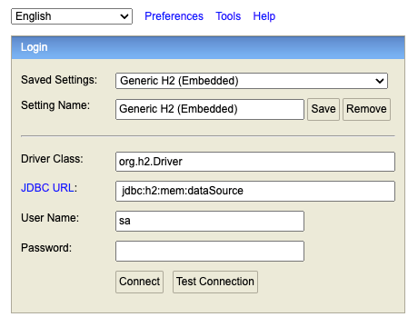

# chapter13.06-calendar #

Execute the below command using Gradle from the project directory:

```shell
./gradlew bootRun
```

Alternatively, if you're using Maven, execute the following command from the project directory:

```shell
./mvnw spring-boot:run
```

To test the application, open a web browser and navigate to:
[http://localhost:8080](http://localhost:8080)


Test the application access with the user `admin1@example.com`/`admin1` for both URLs:
- http://127.0.0.1:8080/admin/h2: Access should be denied
  

- http://localhost:8080/admin/h2: Access should be allowed
  


