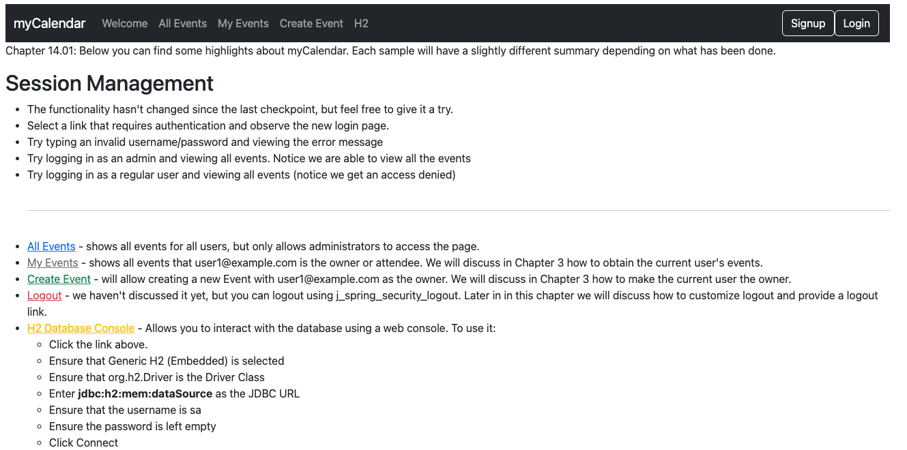
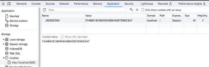
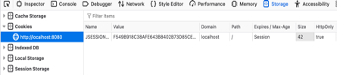

# chapter14.01-calendar #

Execute the below command using Gradle from the project directory:

```shell
./gradlew bootRun
```

Alternatively, if you're using Maven, execute the following command from the project directory:

```shell
./mvnw spring-boot:run
```

To test the application, open a web browser and navigate to:
[http://localhost:8080](http://localhost:8080)


Open two browsers. We'll initiate the session in Google Chrome, steal it from there, and our attacker will log in using the stolen session in Firefox. 

We will use the Google Chrome and the Firefox web developer add-on in order to view and manipulate cookies. 

Open the JBCP calendar home page in Google Chrome:
- Open Developer Tools: Right-click on the webpage and select Inspect or press `Ctrl + Shift + I` (Windows/Linux) or `Cmd + Opt + I `(Mac) to open the Developer Tools.
- Navigate to the Application Tab: In the Developer Tools, you will see a menu at the top. Click on the Application tab.
- Locate Cookies in the Sidebar: On the left sidebar, you should see a Cookies section. Expand it to see the list of domains with their associated cookies.
- Select the Specific Domain: Click on the domain relevant to the website you are interested in. This will display the list of cookies associated with that domain.
- View Cookie Values: You can see the details of each cookie, including its name, value, domain, path, and so on. Look for the specific cookie you are interested in, and you will find its value.


- Select the JSESSIONID cookie, copy the value of Content to the clipboard, and log in to the JBCP calendar application. If you repeat the View Cookie Information command, you'll see that `JSESSIONID` did not change after you logged in, making you vulnerable to a session fixation attack!
- In Firefox, open the JBCP calendar website. You will have been assigned a session cookie, which you can view by using `Ctrl + F2` to open the bottom: Cookie console. Then type in cookie list [enter] to bring up cookies for the current page.
- To complete our hack, we'll click on the Edit Cookie option and paste in the `JSESSIONID` cookie that we copied to the clipboard from Google Chrome, as shown in the following screenshot:



- Keep in mind that newer versions of Firefox include web developer tools, too. However, you will need to ensure that you are using the extension and not the built-in one, as it provides additional capabilities. Our session fixation hack is complete! If you now reload the page in Firefox, you will see that you are logged in as the same user who was logged in using Google Chrome, but without the knowledge of the username and password. Are you scared of malicious users yet?
- Now, re-enable session fixation protection and try this exercise again. You'll see that, in this case, the `JSESSIONID` changes after the user logs in. Based on our understanding of how session fixation attacks occur, this means that we have reduced the likelihood of an unsuspecting user falling victim to this type of attack. Excellent job!
