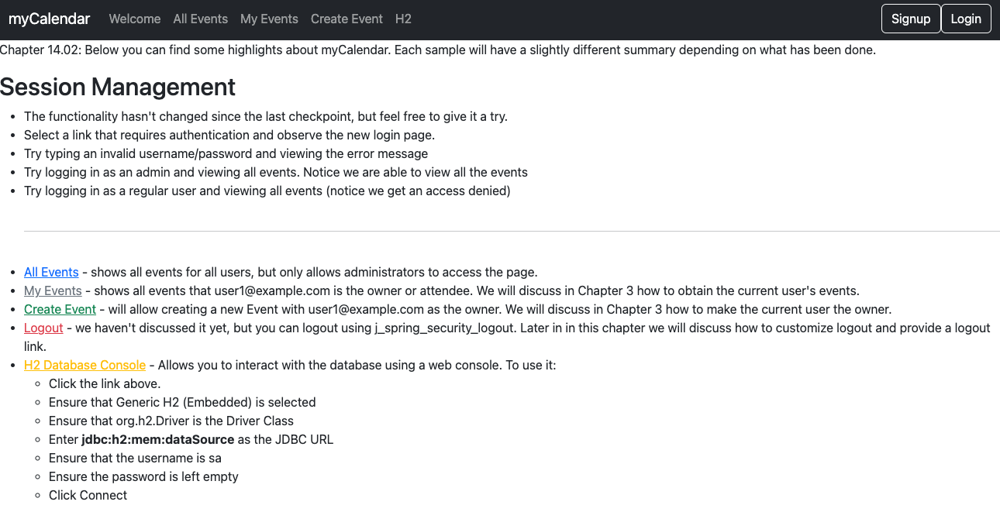
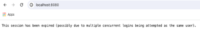

# chapter14.02-calendar #

Execute the below command using Gradle from the project directory:

```shell
./gradlew bootRun
```

Alternatively, if you're using Maven, execute the following command from the project directory:

```shell
./mvnw spring-boot:run
```

To test the application, open a web browser and navigate to:
[http://localhost:8080](http://localhost:8080)


As we did when verifying session fixation protection, we will need to access two web browsers by performing the following steps:
1.	In Google Chrome, log in to the site as `user1@example.com`/`user1`.
2.	Now, in Firefox, log in to the site as the same user.
3.	Finally, go back to Google Chrome and take any action. You will see a message indicating that your session has expired, as shown in the following screenshot:


If you were using this application and received this message, you'd probably be confused. 
This is because it's obviously not a friendly method of being notified that only a single user can access the application at a time. However, it does illustrate that the session has been forcibly expired by the software.


