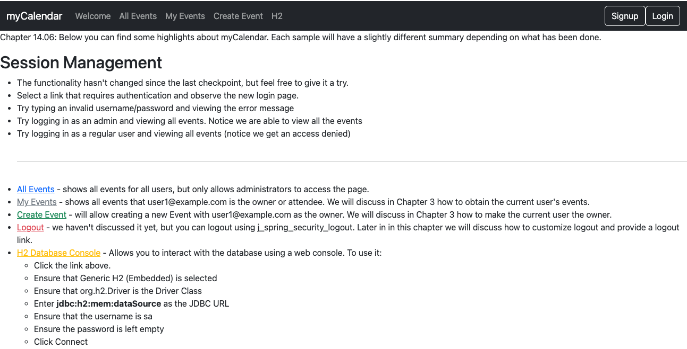
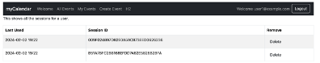

# chapter14.06-calendar #

Execute the below command using Gradle from the project directory:

```shell
./gradlew bootRun
```

Alternatively, if you're using Maven, execute the following command from the project directory:

```shell
./mvnw spring-boot:run
```

To test the application, open a web browser and navigate to:
[http://localhost:8080](http://localhost:8080)


Log in to it using `user1@example.com`/`user1` in `Google Chrome`. 

Now, log in using `Firefox` and click on the `user1@example.com` link in the upper-right corner. 

You will then see both sessions listed on the display as shown in the following screenshot:


While in `Firefox`, click on the Delete button for the first session. 
This sends the request to our deleteSession method of `UserSessionsController`. 

This indicates that the session should be terminated. 

Now, navigate to any page within `Google Chrome`. You will see the custom message saying the session has been forcibly terminated. 

While the message could use updating, we see that this is a nice feature for users to terminate other active sessions.

