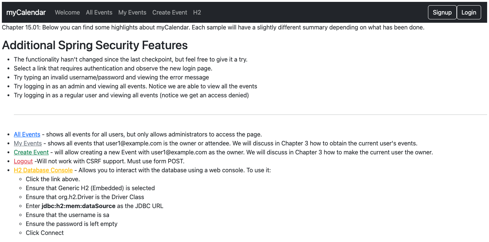

# chapter15.01-calendar #

Execute the below command using Gradle from the project directory:

```shell
./gradlew bootRun
```

Alternatively, if you're using Maven, execute the following command from the project directory:

```shell
./mvnw spring-boot:run
```

To test the application, open a web browser and navigate to:
[http://localhost:8080](http://localhost:8080)


Start up the JBCP calendar application and navigate to the login page at http://localhost:8080/login.html, 
Check the generated source for the `login.html` page.


