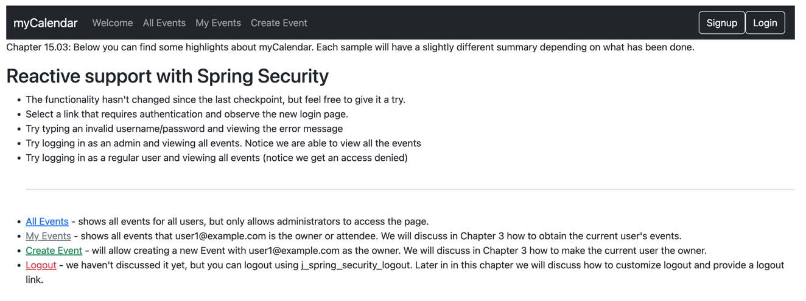

# chapter15.03-calendar #

Execute the below command using Gradle from the project directory:

```shell
./gradlew bootRun
```

Alternatively, if you're using Maven, execute the following command from the project directory:

```shell
./mvnw spring-boot:run
```

To test the application, open a web browser and navigate to:
[http://localhost:8080](http://localhost:8080)


- Launch the application and try to access it through http://localhost:8080.
- You should be able to log in with the configured users admin1@example.com/admin1 or user1@example.com/user1 and test the events creation.
- Furthermore, creating a new user enables immediate login with the newly created credentials.

