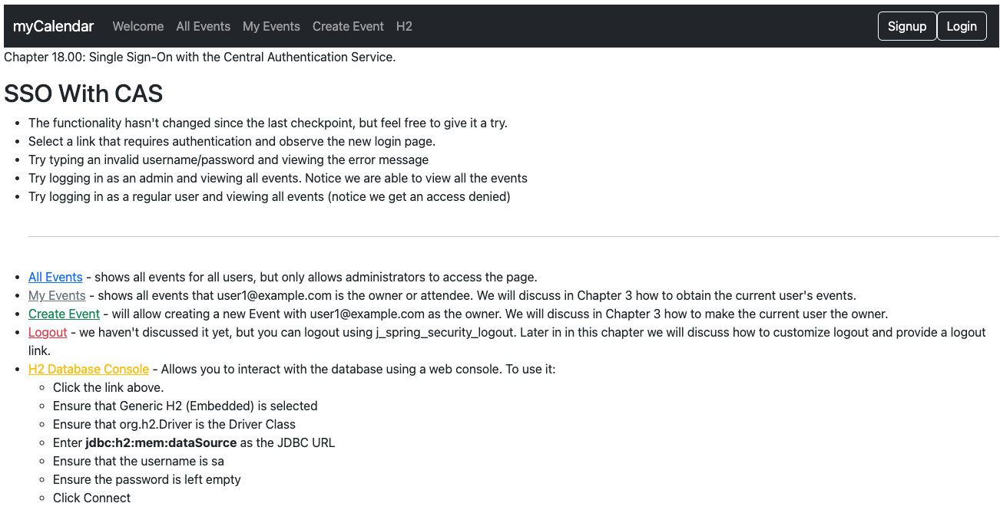

# chapter18.00-calendar #

Import the JBCP Calendar application certificate inside the JRE keystore of your CAS Server, by running the following command from the following location chapter18.00-calendar/src/main/resources/keys . When asked for the password the keystore password is in general change it.

```shell
keytool -importkeystore -srckeystore tomcat.jks -destkeystore $CAS_JAVA_HOME/lib/security/cacerts  -deststoretype JKS -alias jbcpcalendar 
```
The variable $CAS_JAVA_HOME is the JVM used by the CAS Server.

To check the import is done successfully, you can run the following command. When asked for the password the keystore password is in general change it.

```shell
keytool -list -keystore $CAS_JAVA_HOME/lib/security/cacerts -alias jbcpcalendar
```

The output should be similar to following:

```shell
jbcpcalendar, May 6, 2024, PrivateKeyEntry, 
Certificate fingerprint (SHA-256): 79:0D:62:D7:E7:A1:25:1D:A3:C7:93:F6:03:A8:E4:B8:20:BA:FA:2B:03:9F:5C:E3:5D:6C:61:A5:6F:CD:83:57
```


Execute the below command using Gradle from the project directory:
```shell
./gradlew bootRun
```

Alternatively, if you're using Maven, execute the following command from the project directory:

```shell
./mvnw spring-boot:run
```

To test the application, open a web browser and navigate to:
[https://localhost:8443/](https://localhost:8443/)



