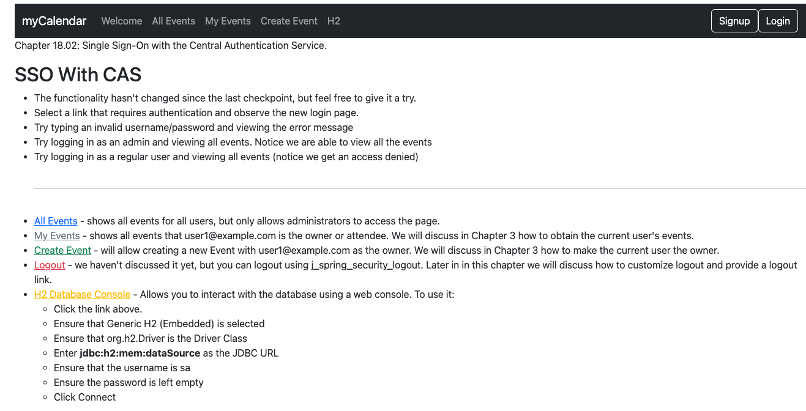
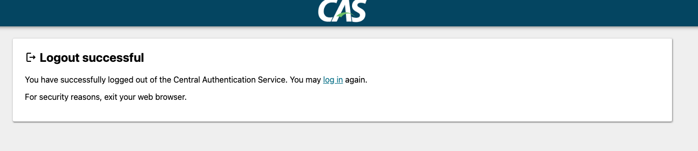

# chapter18.02-calendar #

Execute the below command using Gradle from the project directory:

```shell
./gradlew bootRun
```

Alternatively, if you're using Maven, execute the following command from the project directory:

```shell
./mvnw spring-boot:run
```

To test the application, open a web browser and navigate to:
[https://localhost:8443/](https://localhost:8443/)


You can then log in using the username `casuser` and the password `Mellon`.

Try logging out now. You will observe that you are logged out.

Now, try logging back in and visiting the CAS server's logout URL directly. For our setup, the URL is https://localhost:9443/cas/logout.


Now, try to visit the JBCP calendar application. You will observe that you are unable to access the application without authenticating again. This demonstrates that a single logout works.


