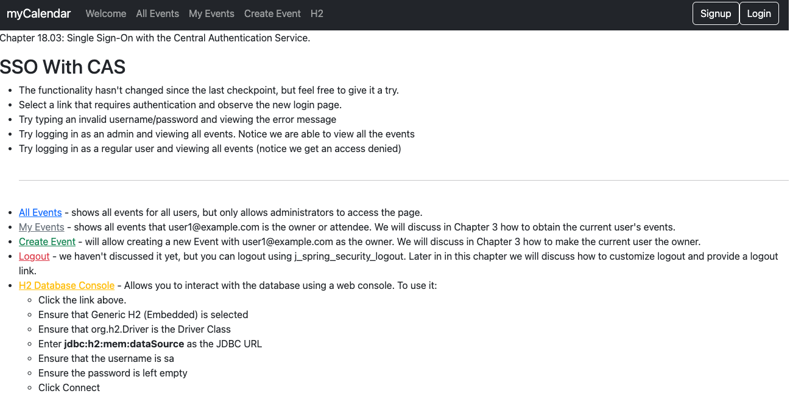
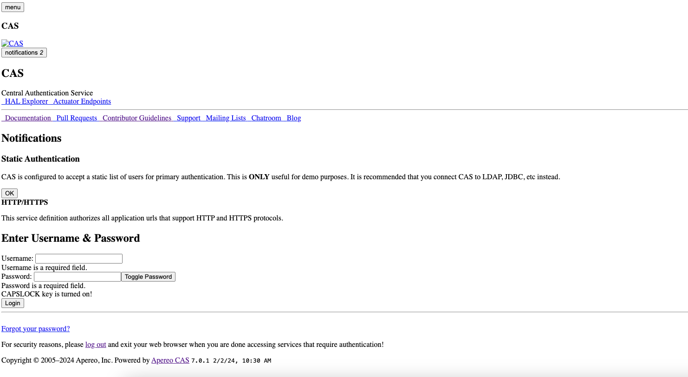

# chapter18.03-calendar #

Execute the below command using Gradle from the project directory:

```shell
./gradlew bootRun
```

Alternatively, if you're using Maven, execute the following command from the project directory:

```shell
./mvnw spring-boot:run
```

To test the application, open a web browser and navigate to:
[https://localhost:8443/](https://localhost:8443/)



Visit https://localhost:8443/echo to see it in action. 

You can then log in using the username `casuser` and the password `Mellon`.

The page looks a lot like the CAS login page (minus the CSS).


This is because the controller attempts to echo our My Events page, and our application does not yet know how to authenticate a PT.

This means it is redirected to the CAS login page. Let's see how we can authenticate proxy tickets.


