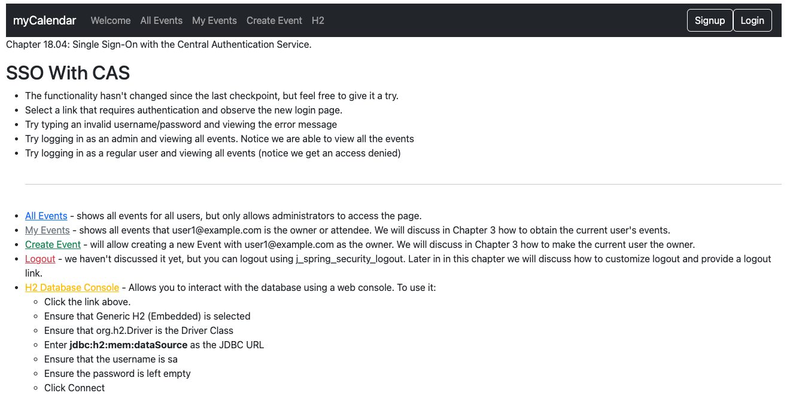
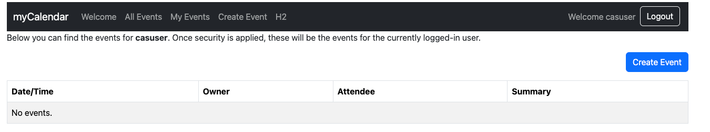

# chapter18.04-calendar #

Execute the below command using Gradle from the project directory:

```shell
./gradlew bootRun
```

Alternatively, if you're using Maven, execute the following command from the project directory:

```shell
./mvnw spring-boot:run
```

To test the application, open a web browser and navigate to:
[https://localhost:8443/](https://localhost:8443/)


You can then log in using the username `casuser` and the password `Mellon`.

Visit https://localhost:8443/echo again. This time, you should see a JSON response to calling our `My Events` page.



