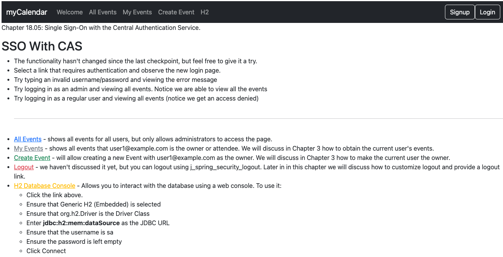
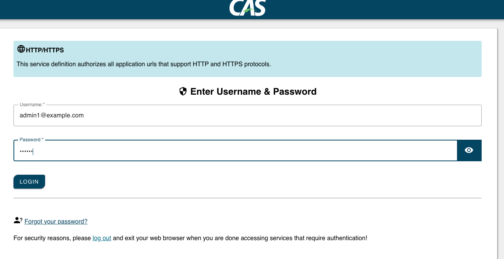
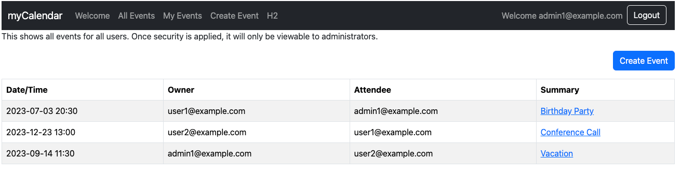

# chapter18.05-calendar #

Execute the below command using Gradle from the project directory:

```shell
./gradlew bootRun
```

Alternatively, if you're using Maven, execute the following command from the project directory:

```shell
./mvnw spring-boot:run
```

To test the application, open a web browser and navigate to:
[https://localhost:8443/](https://localhost:8443/)



Authenticate it using `admin1@example.com`/`admin` or `user1@example.com`/`user1`.

Go ahead and try it to see that it works. If it does not work, try checking the logs and comparing your configuration with the sample configuration.



