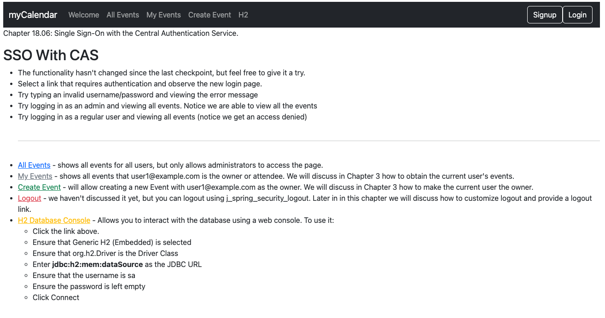
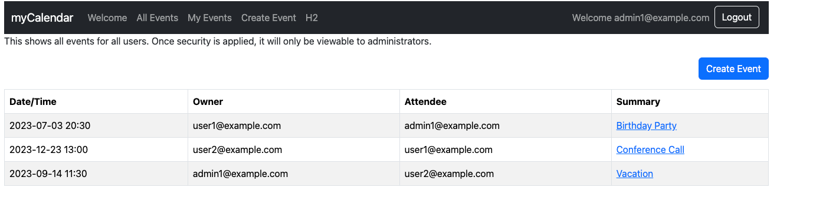
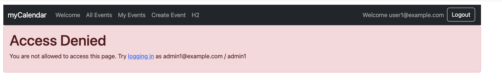

# chapter18.06-calendar #

Execute the below command using Gradle from the project directory:

```shell
./gradlew bootRun
```

Alternatively, if you're using Maven, execute the following command from the project directory:

```shell
./mvnw spring-boot:run
```

To test the application, open a web browser and navigate to:
[https://localhost:8443/](https://localhost:8443/)


We are successfully Getting the UserDetails object from a CAS assertion.

Authenticate it using `admin1@example.com`/`admin`


Authenticate it using `user1@example.com`/`user1`:
With user1 credentials, you cannot have access to `My Events`  pages.



