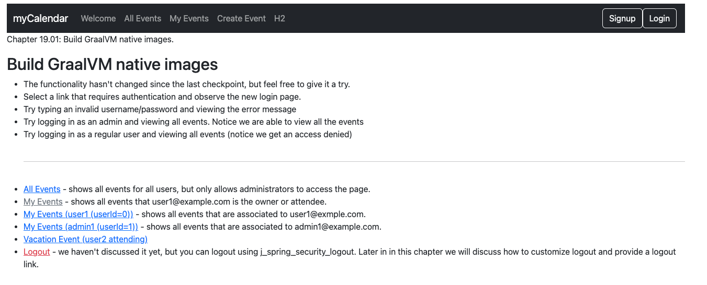

# chapter19.01-calendar #

## Prerequisites for Buildpacks ##

Ensure Docker is installed by referring to the details in the Docker documentation (Get Docker | Docker Docs). If you are using Linux, configure Docker to permit non-root users.
For macOS users, it is advisable to enhance the allocated Docker memory to a minimum of 8 GB and consider adding more CPUs. On Microsoft Windows, ensure optimal performance by enabling the Docker WSL 2 backend (Docker Desktop WSL 2 backend on Windows | Docker Docs).


## Building GraalVM images using Buildpacks and Gradle ##

Execute the below command using Gradle from the project directory:

```shell
./gradlew bootBuildImage
```

## Building GraalVM images using Buildpacks and Maven  ##

```shell
./mvnw -Pnative spring-boot:build-image
```

## Running GraalVM images from Buildpacks  ##
After executing the relevant build command for Maven or `Gradle`, a `Docker` image should be accessible. 

Initiate your application by utilizing the docker run command:

```shell
docker run --rm -p 8080:8080 docker.io/library/chapter19.01-calendar:0.0.1-SNAPSHOT
```

## Prerequisites for Native Build Tools ##
To generate a native image with the Native Build Tools, ensure that you have a GraalVM distribution installed on your system.
For our examples, we will use `bellsoft-liberica-vm-openjdk17-23.0.3` that is available in the Liberica Native Image Kit Download Center (Download Liberica Native Image Kit, NIK 23 (JDK 17).


## Building GraalVM images using Native Build Tools and Maven ##

Execute the below command using Gradle from the project directory:

```shell
./mvnw -Pnative native:compile
```

## Building GraalVM images using Native Build Tools and Gradle  ##

```shell
./gradlew nativeCompile
```

## Running GraalVM images with Native Build Tools   ##

You can locate the native image executable within the directory named `build/native/nativeCompile` if using `gradle`.
Or `target` directory if using `Maven`

For `Maven` for example, you  can run the application by executing it directly:

```shell
target/chapter19.01-calendar
```

## Testing the application  ##

To test the application, open a web browser and navigate to:
[http://localhost:8080](http://localhost:8080)


To gracefully shut down the application, press `Ctrl + C`.


